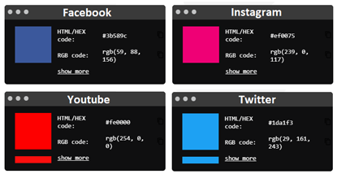
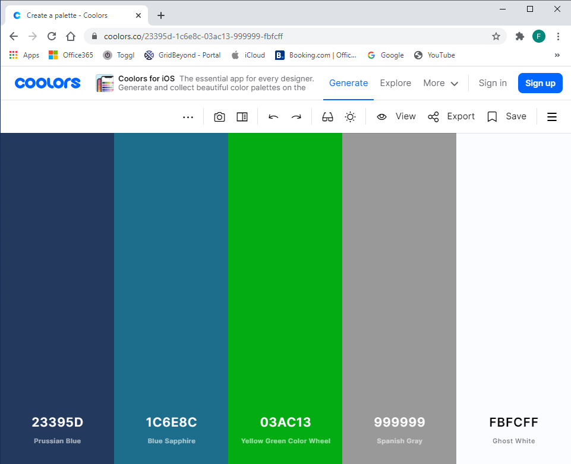
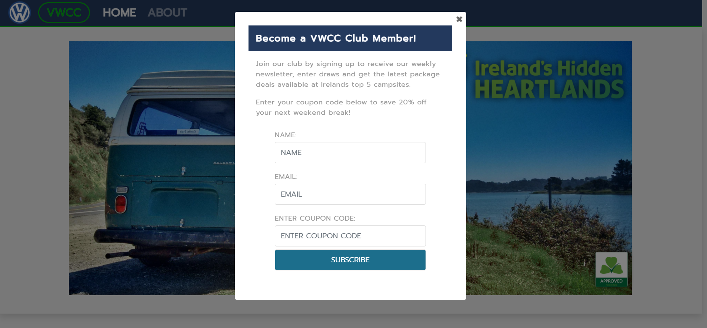
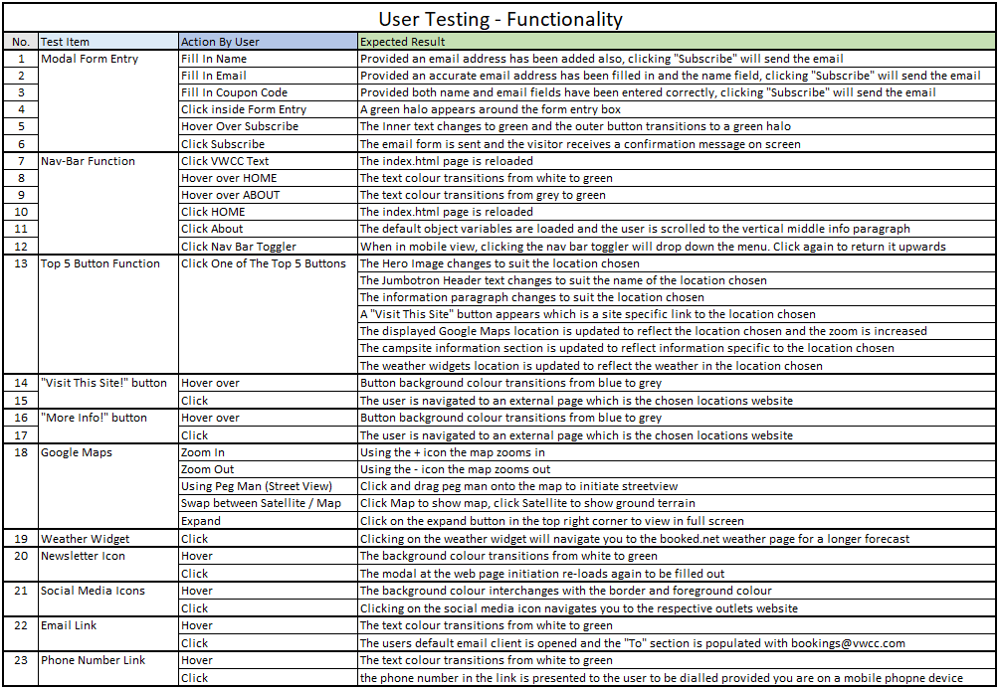
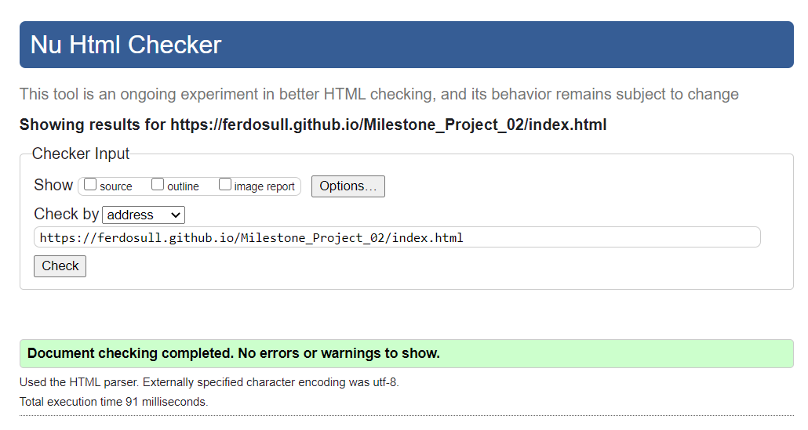
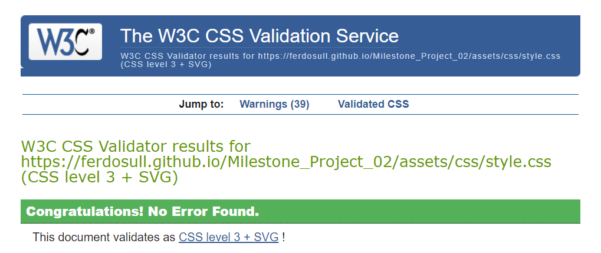
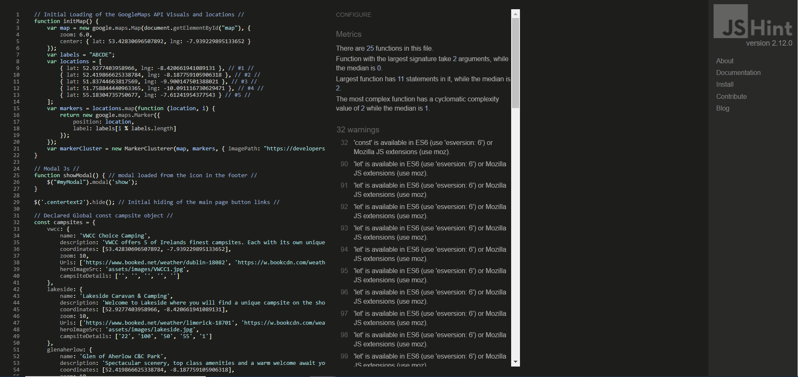
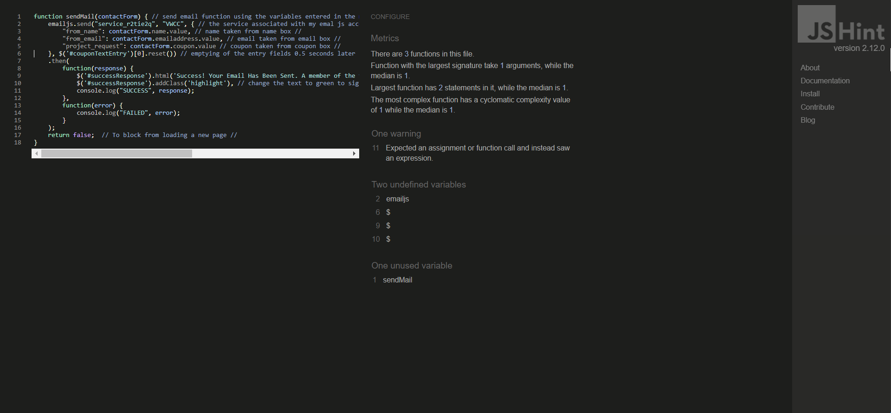

# Milestone Project 02 

### Volkswagon Choice Camping Top 5 Destinations  

## Table of contents
1. [Introduction](#intro)
2. [Responsive Design](#responsive_design)
3. [My Project Description and Design](#project_description)
    1. [Wire Frames](#wire_frame)
    2. [Pop up Modal](#pop_modal)
    3. [Nav Bar](#nav_bar)
    4. [Hero Image](#hero_image)
    5. [Header & Description Text](#header_description)
    6. [Page Links](#page_links)
    7. [Top 5 Buttons](#t5_buttons)
    8. [Google Maps](#g_map)
    9. [Campsite Information](#campsite)
    10. [Footer](#footer)
4. [Utilising the 5 Planes of UX Design](#ux_design)
    1. [The Strategy Plane](#strategy_plane)
    2. [The Scope Plane](#scope_plane)
    3. [The Structure Plane](#structure_plane)
    4. [The Skeleton Plane](#skeleton_plane)
    5. [The Surface Plane](#surface_plane)
5. [Typography](#typography)
6. [User Stories](#user_stories)
    1. [External User's Goal](#external_user_goal)
    2. [Site Owner's Goal](#site_owner_goal)
    3. [First Time User Goals](#first_time_user_goals)
    4. [Returning User Goals](#returning_user_goals)
    5. [Frequent User Goals](#frequent_user_goals)
7. [Bugs and Fixes](#bug_fixes)
8. [References and Credits Section](#references_and_credits)
    1. [Code](#code)
    2. [Media](#media)
9. [User Testing](#testing)
    1. [Website Responsiveness through Browser and Device Compatibility](#testing_procedure)
    2. [Call to Action Functionality Testing](#testing_user_stories)
    3. [HTML CSS and JavaScript Validation](#validation)
10. [Future "Nice to Have" Additions to The Website](#additions)
11. [Creation of Template and Deployment of Project](#project_deployment)
    1. [Creating a New Project](#new_project)
    2. [Commands Utilised Throughout The Project After Changes](#commands)
    3. [How to Deploy My Milestone\_Project\_02 on GitHub Pages](#how_to_deploy)
    4. [How to Download, View and Edit This Project Locally using Notepad++](#how_to_download)
12. [Acknowledgements](#acknowledgements)  

## Introduction 

My Milestone Project 2 was envisioned by me and created based on the knowledge gained so far from this course. 
I have taken the fundamentals that I have learned from the course and applied them to this website with style changes and JS functions to suit my application.
I hope that the outcome of my works has translated into a front-end web application with JavaScript functions, that is accessible, responsive and promotes good user experience
through the use of HTML, CSS, Javascript, Google Maps API and Email.js.
As well as the course materials, there have been some additional code examples which I have found online and utilised. 
These additions have been highlighted and referenced later on in this document (references and credits section).
As well as these additions I have received excellent correction & further instruction from my mentor Maranatha Ilesanmi which I am extremely grateful for.

## Responsive Design 

As can be seen in the screenshot below, media queries have been used to ensure that the website is completely responsive across Desktop and Mobile devices.

View the live project here:[ VWCC ](https://ferdosull.github.io/Milestone_Project_02/index.html)  

## My Project Description and Design 

The VWCC website is a single page responsive website which utilises JQuery & javasript methods and functions to change displayed data, images and navigation links. 
Please see initial envisioned wireframes for desktop and mobile devices (before project start) and actual screenshots of the finished website in the sections that follow:
  

### Wire Frames 

The wire-frames I found to be very useful this time around. I had envisioned doing a top 10 campsites as can be seen in the wire-frames above, but the workload was too much to 
try and fit into the time frame before submission. The code (JavaScript "campsite" Object) has been left in such a way that five or ten more locations could be added at a later date, 
at the clients request quite efficiently.
  

### Pop up Modal 

The Pop-Up modal is the first item to load from the script.js file once the main page has been loaded. The Pop-up modal is my take on utilising the form element in conjunction with EmailJs (sendMail.js).
It is fully functioning as can be seen from the incorporated screenshots below. I have changed the "Project Request" section to be an "Enter Coupon" section for redeeming percentage-off holiday stays to change things up a bit.
I have only used the "required" status for the name and email element form entry just incase the visitor does not have a coupon code but still wishes to subscribe to the VWCC club. I feel this partivular element ticks the 
box for design interactivity as it lets the user initiate and control actions, and gives feedback in the form of a success message after the email has been sent using EmailJs. Using the "required" staus in the form also ensures 
that empty or invalid input data is handled correctly and hint text is given.
  

### Nav Bar 

On this occassion I have decided not to have the nav-bar fixed to the top. Once the page is scrolled it stays at its absolute location. I felt that the minimal appearance I was going for would appear 
crowded in this circumstance if the nav-bar followed. The nav-bar can be separated up into desktop and mobile views as seen below. The "HOME" and VWCC logo both reload the page while the "About" selector 
scrolls the visitor to the info section, which is roughly halfway down the page.
  

### Hero Image 

The Hero Image that loads upon first display of the page is of an iconic VW campervan, which is keeping in line with the clubs theme. This image is then updated through five other images using button clicks 
to initialte JavaScript targeting of Id's in the html and changing the image source. This is completed with delay transition timers in conjunction with the addion and removal of CSS classes to provide opacity effects.
  

### Header & Description Text 

The Header text, when first landed on the page, is the name of the club, "Volkswagon Choice Camping" and the description text below it is a small summary of what the club provides the site user.
Both the Header and the description text get updated when any of the Top five buttons are pressed. For example, if "Lakeside C&C Park" is clicked/selected the header text and description text will change to 
be in line with the button chosen. Like the hero image, this is also completed with delay transition timers in conjunction with the addion and removal of CSS classes to provide opacity effects.
  

### Page Links 

Underneath the description text are two selectors. "More Info!" and "Visit This Site!". The "More Info!" button is only visible on tablet and mobile devices. Its function is to scroll the visitor to the 
campsite information section associated with the location that is currently being displayed. The "Visit This Site!" button has a href that is updated by JavaScript based also on the location being displayed.
If pressed, it will navigate the user to an external page associated with the campsite selected.
  

### Top 5 Buttons 

The Top 5 Buttons are used as "onclick" functions within the html, passing the five different key value variables for my object ("campsites") through the "initMod" function.
The initMod function extracts only the required values from my object by using a filter method to update the global variables to be used by the subsequent functions.
  

### Google Maps 

When landing on the page initially the Google Maps div displays the Top 5 locations on a zoomed out map of Ireland.
When any of the Top 5 buttons are clicked/selected, that particular location selected is displayed and zoomed closer, 
with its full name as the label instead of a zoomed out capitol letter character, as was displayed initially.
  

### Campsite Information 

The campsite Information Section displays the following information for each site: Daily Stay Rate, Weekly Stay Rate, Weekend Stay Rate, 
The Campsite Pitch Capacity and the Advance Notice period for booking a stay with the campsite in question. Again, like before, this information updates for 
each location based on the button clicked/selected.
  

### Footer 

The footer contains 3 sections, 1. A weather widget which also updates upon utilising the Top 5 buttons, 2.  A small paragraph 
enticing visitors of the site to join the club. At the end of this paragraph is a font awesome icon (newsletter) which, if clicked/selected, will re-load the 
modal form again to allow the visitor a second time option to subscribe. 3. Social media icons which link to their respective pages, an email link which opens the 
visitors default email service and populates the “To” section with bookings@vwcc.com, and an external phone link shortcut for use when viewed on mobile phone devices.

To ensure that I utilised the correct icon colours for each of the social media outlets in the footer I navigated to their official brand media pages 
and used a HTML colour picker to select the correct colour. 
Please see the image below of the colours picked for each icon using the following HTML colour picker: https://imagecolorpicker.com/en/
  

  

## Utilising the 5 Planes of UX Design 

**The Strategy Plane** 

The strategy plane here is concerned with attracting and inspiring Volkswagon and Campervan enthusiests to get outdoors, and go visit the Top five campsite locations that Ireland has to offer.
I feel that this has been achieved by placing all the users requirements on a single, easy to use page, where all info about a specific location is only 1 click away.
The site owner’s business objectives are also met by attracting people that may initially only want to holiday in a certain location, but they are then introduced to four other locations, and given the oppertunity
to earn points to enjoy return vacations at a reduced rate.

**The Scope Plane** 

The website, I feel, incorporates modern techniques to be in line with what is current, and trys to enhance the users experience by having one button clicks carry out many tasks. 
Once initially navigated to the website, the user is greeted by a pop-up modal form (EmailJS) which gives a new or returning user the oppertunity to subcribe to the VWCC campervan club newsletter, 
or to enter a coupon code to redeem percentage discounts by email. When all areas have been completed successfully, and once ‘Subscribe’ has been pressed, the form carries out a reset of all entries . 
A success message is displayed inside the modal to let the user know there request has been sent. The background, on button click, interchanging hero image, in my opinion gets the message across well 
through campsite specific imagery. I feel the interchanging of all site specific information on the click of a button is a nice feature which provides instant results to the user. 
It does this also by scrolling the user back to the header and info text which has now changed to suit the specific location. 
A "More Info! button appears on mobile devices to create easy navigation to the Campsite Information Section.

**The Structure Plane** 

This website is a single page layout that trys to be simplistic in its approach. It is navigated from top to bottom. It has a nav-bar at the top and a footer at the bottom. 
The nav-bar turns into a mobile friendly toggler once below a specific resolution. Underneath the nav-bar is where the “Hero-Image” is located. 
Underneath the hero image is where the jumbotron header and info paragraph can be found. 
The hero image, jumbotron header and info paragraph are all updated through JavaScript once one of the five buttons are clicked/selected. Below the info paragraph is the “Visit This Site!” button. 
This is hidden until a campsite is selected. Once a campsite is selected, this same button will navigate you to the external website associated with that campsite.
There is a “More Info!” button below the “Visit This Site!” button, that is only displayed on mobile devices to allow for fast scroll to the campsite information section.
The five buttons that carry out this function can be found in the vertical middle of the page. Underneath the five buttons are the Google Maps display div and the individual campsite information section.
The Google Maps div and the campsite information section are presented as two, side by side columns on desktop devices and they transition to single columns when viewed on mobile devices. 
Both the Google Maps display coordinates and campsite information sections are also updated upon one of the five campsite buttons being clicked/selected.
The footer contains three sections, 1. An onclick button updated weather widget, 2. A small paragraph, again urging visitors of the site to join the club, 3. Social media icons, email and phone links.
The links that lead to external content like campsite webpages and social media pages will open on a new tab. The user will not lose the page that they were on before clicking the link.

**The Skeleton Plane** 

The website will have a consistently placed background hero image with six sub sections below it. The use of [colours](#colours), [fonts](#typography) and responsive elements were carefully chosen. 
Consideration was given to make the content well placed, clear and well presented, utilising contrasting colours , right size & style fonts and adequate spacing. 
In order to try and capture the "Holiday" theme I have used pictures from each location which I feel serve the purpose of attracting potential holidayers.
My Balsamic [wire frames](#wire_frame) have been a great tool this time around to envision what the end result would be. It has changed slightly since initiated but over all, the 
element's function's remain the same and are more or less located in the same X, Y plane.

**The Surface Plane** 

The colours and imagery used on this website, I feel, are really in line with the promotion of the stay in Ireland holiday theme. I have used a mix of whites, greys, blues and greens to cultivate this theme. 
The palette I chose was created at [www.coolers.co](https://coolors.co/) 

I have used background shading and opacity shadows to highlight the jumbotron header and the hovering and clicking of items in the pop-up modal. I feel the contrasting colours and grey backgrounds 
separate the page elements enough so that they remain individual, yet part of a combined theme. What I was trying to achieve with the webpage layout was a minimalistic appearance, yet 
powerful JavaScript methods & functions make alot more possible when buttons are clicked, which is hidden behind this simplistic landing page layout. 
Hovering over links, buttons and text selectors causes the elements to change colour, alerting the user to the presence of their mouse pointer. 
For the social media icons, I utilised the official brand media colours. Once the mouse pointer hovers over the icon the background colour and the foreground colours interchange. 
  

## Typography 

The fonts used for the milestone project are: “Voltaire” and “Prompt”. 

Both fonts were located and used from the website:[ https://fonts.google.com/ ](https://fonts.google.com/)

I felt the contrast between Voltaire and Prompt has worked quite well. I have used Prompt for the nav bar and the jumbotron header and throughout the rest of 
the project I have used Voltaire to bring the almost cartoon-like feeling associated with the colour scheme. I have made subtle changes to the font sizes and 
spacings for responsiveness as can be seen on the webpage and in the style.css sheet. 
  

## User stories 

**External user’s goal:** 

The site's users are Volkswagon enthusiasts or Campervan enthusiasts who like holidaying in Irelands Top 5 outdoor locations.

**Site owner's goal:** 

The goal is to spread the word to as many campervan enthusiasts as possible that these locations are the Top 5 campsite destinations in Ireland.
This will be achieved by presenting a pop up modal as soon as you visit the site asking you to subscribe. Once subscribed, weekly or monthly newsletters will be issued with 
special offers and coupon codes. The end result will be additional business built up for the five campsites mentioned with users that will frequent all of these locations.

**First Time User Goals** 

- As a First Time User, I want to know what are the Top 5 campsite locations in Ireland. [Click for Screenshot](#header_description)
- As a First Time User, I want to subscribe to the VWCC club and be made aware of upcoming special offers and events. [Click for Screenshot](#site_owners_goal)
- As a First Time User, I want to visualise using Google Maps where these exact locations are. [Click for Screenshot](#g_map)
- As a First Time User, I want to see pictures of the locations when I select the location buttons. [Click for Screenshot](#hero_image)
- As a First Time User, I want to read site specific information about rates, capacity and advanced notice periods. [Click for Screenshot](#campsite)
- As a First Time User, I want to know what the weather is like in that specific location. [Click for Screenshot](#footer)
- As a First Time User, I want to navigate to the specific locations own website. [Click for Screenshot](#page_links)

**Returning User Goals** 

- As a Returning User, I want to check out other campsite locations if I have just come back from a stay at one. [Click for Screenshot](#t5_buttons)
- As a Returning User, I want to enter a coupon code on the pop-up modal to redeem my special offer. [Click for Screenshot](#site_owners_goal)
- As a Returning User, I want to locate on Google Maps where my next holiday destination is. [Click for Screenshot](#g_map)
- As a Returning User, I want to know what the weather is like in that specific location for a potential upcoming stay. [Click for Screenshot](#footer)
- As a Returning User, I want to check the pricing associated with each location. [Click for Screenshot](#campsite)
- As a Returning User, I want to call or email the company directly. [Click for Screenshot](#footer)

**Frequent User Goals** 

- As a Frequent User, I want to input coupon codes to redeem special offers. [Click for Screenshot](#site_owners_goal)
- As a Frequent User, I want to access the campsite specific information to see if pricing has decreased during the off season. [Click for Screenshot](#campsite)
- As a Frequent User, I want to call or email the company directly. [Click for Screenshot](#footer)
  

## Bugs and Bug Fixes 

During the creation of this project I encountered many bugs, mostly associated with display on mobile devices and JavaScript functions. Media Queries, further 
styling and Google Inspect were used to eliminate the bugs encountered for display. Transitions between hero images using javascript and css proved hard to get the end result correct.
To ensure the transitions were smooth and happended when they were supposed to, I used "setTimeOut" intervals between transitions and adding and removing opacity classes. 
This was by far the hardest one to get right. For any other fixes to bugs that were encountered I used console.log() to see the actual result as opposed to the expected result, 
and changes were made from there to eliminate the bug.
  

## References and Credits Section 

**Code:** 

The code for the Modal Coupon Entry section for forcing INPUT to UPPERCASE was found at the following location:
[:https://www.the-art-of-web.com/html/input-field-uppercase/?hilite=%7Bwords%7D ](https://www.the-art-of-web.com/html/input-field-uppercase/?hilite=%7Bwords%7D)

Hi have utilised a weather widget from the following website link and styled it to fit in with the websites colour theme:
[https://www.booked.net/widgets/weather](https://www.booked.net/widgets/weather)

The [ Google Maps API ](https://developers.google.com/maps) and [EmailJs](https://www.emailjs.com/) were also utilised as technologies in my project.
  

**The following list of external stylesheets and scripts were utilised in the creation of this project:**

Bootstrap Scripts and Stylesheets:
[ Bootstrap CSS ](https://stackpath.bootstrapcdn.com/bootstrap/4.3.1/css/bootstrap.min.css) 
[ Bootstrap Script ](https://stackpath.bootstrapcdn.com/bootstrap/4.3.1/js/bootstrap.min.js) 

Fontawesome Stylesheets:
[ Fontawesome1 ](https://use.fontawesome.com/releases/v5.6.1/css/all.css) 
[ Fontawesome2 ](https://maxcdn.bootstrapcdn.com/font-awesome/4.7.0/css/font-awesome.min.css)

Google fonts Stylesheets:
[ Google Font1 ](https://fonts.googleapis.com/css2?family=Voltaire&display=swap) 
[ Google Font2 ](https://fonts.googleapis.com/css2?family=Prompt&display=swap)

JavaScript and Jquery:
[ EmailJs ](https://cdn.jsdelivr.net/npm/emailjs-com@2/dist/email.min.js)
[ Google Maps ](https://developers.google.com/maps/documentation/javascript/examples/markerclusterer/markerclusterer.js)
[ Google API ](https://ajax.googleapis.com/ajax/libs/jquery/1.12.4/jquery.min.js)
  

**Media** 

The photos used for the hero Images were taken from [https://unsplash.com/ ](https://unsplash.com/) and site specific photos of the locations were googled and borrowed from the individual campsites website or social media outlet.

Please see list of credits below for the owner of each photo: 

* ian-wagg-Y6_i7U4Dyu8-unsplash – Photo by[ Ian Wagg ](https://unsplash.com/s/photos/lakeside-camping?utm_source=unsplash&amp;utm_medium=referral&amp;utm_content=creditCopyText)on[ Unsplash ](https://unsplash.com/)

* ian-usher-Af1OMQpuN14-unsplash – Photo by[ Ian Usher ](https://unsplash.com/s/photos/campervan?utm_source=unsplash&amp;utm_medium=referral&amp;utm_content=creditCopyText)on[ Unsplash ](https://unsplash.com/)

* glenaherlow – Photo by[ Glen of Aherlow Campsite ](https://visitballyhoura.com/explore/glen-of-aherlow-caravan-camping-park)on[ Visit Ballyhoura ](https://visitballyhoura.com/explore/glen-of-aherlow-caravan-camping-park)

* goosey – Photo by[ Goosey Island Campsite ](https://www.facebook.com/GooseyIslandMotorhomePark/)on[ Facebook ](https://www.facebook.com/)

* knockalla – Photo by[ Knockalla Campsite ](https://www.facebook.com/Knockalla-Caravan-Camping-Park-360417284021546/)on[ Facebook ](https://www.facebook.com/)

* wavecrest – Photo by[ Wavecrest Campsite ](https://www.google.com/url?sa=i&url=https%3A%2F%2Fwww.camping-ireland.ie%2Fparks%2Fkerry%2Fwave-crest-caravan-park&psig=AOvVaw2bQPXo9-GR4T-6YeXQjApy&ust=1616227957944000&source=images&cd=vfe&ved=0CAIQjRxqFwoTCOjSsr70u-8CFQAAAAAdAAAAABAD)on[ Camping Ireland ](https://www.camping-ireland.ie/parks/kerry/wave-crest-caravan-park)

I’d like to say thank you to the photographers who provided the content above via Unsplash, Facebook and the campsites in question for the creation of this ficticious website.
  

The Logo used in the nav bar is the official Volkswagon Brand logo. It was found at the following location: [www.freebiesupply.com ](https://cdn.freebiesupply.com/logos/large/2x/volkswagen-3-logo-png-transparent.png)
  

**Content:** 

The content for this site is based on real campsite locations. I have visited some of these locations myself previously. 
The Campsite information itself in relation to weekly, daily and weekend rates is purely fictional but not far off what the going rates would be. 

For the info paragraphs associated with each location I have taken and augmented snippets of text from the campsites own website write-ups.

It was clear early on that the colour scheme I chose was very Irish and to strenthen that further I took inspiration from the 
Aerlingus colour scheme when finalising and adding to my colour pallete.

[ Aer Lingus ](https://www.aerlingus.com/html/en-IE/home.html?gclid=CjwKCAjw9MuCBhBUEiwAbDZ-7iZF_UKK1pK2gWBDKge3t2a7ypPL_0KGkiO0QQ4dM-VhtYMqhfWG_RoCdjwQAvD_BwE&gclsrc=aw.ds)
  

## User Testing 

**Website Responsiveness through Browser and Device Compatibility** 

The interactive front-end web application was tested throughout the development, implementation and deployment stages of the project.

For the continued functionality and responsiveness testing of this website I have utilised the following web browsers: Microsoft Edge, Mozilla Firefox and Google Chrome.

To carry out testing on mobile devices I have used Google Chrome as well as Safari on my IPad and IPhone.

During all stages of development, HTML, CSS and JavaScript method & function verification, console.log() was utilised to simulate the required outcome before implementing the end result on the page.  

Please see the testing procedure table I have created for the VWCC website below:
  

**Call to Action Functionality Testing Procedure** 

The table below was created to ensure no user testing steps were omitted when carrying out finished website checks. As part of my finised manual testing checks I have had a friend of mine 
who is a senior UX designer, navigate through the site using the table created to search for errors. Initial errors that were found have been solved. They can be found in the bugs section.
  

At all stages during testing, text was evaluated for spelling, grammer and punctuation.
  

**HTML CSS and JavaScript Validation** 

Testing Code Validators for all sections of the website were carried out at: 

HTML =[ https://validator.w3.org/ ](https://validator.w3.org/) CSS =[ https://jigsaw.w3.org/css-validator/ ](https://jigsaw.w3.org/css-validator/) and JavaScript = [ https://jshint.com/ ](https://jshint.com/)

Below are screenshots of the results of my HTML page, my CSS stylesheet, and both JavaScript files. All Sections Passed with no errors:

### index.html

### style.css

### scripts.js

### sendMail.js

  

## Future "Nice to Have" Additions to The Website 

If I could make further additions to the VWCC website down the line they would be to include the following:

 * A "Log In" and payments section for returning users. This would provide processing and storage of the visitors previous vacation information, similar to booking.com.
 Accumulated trips with the VWCC would enable them to build up points whereby further discounts or coupons could be passed back to the visitor.

 * At some point down the line I would envision the Top 5 website becoming the Top 10 or the Top 20. The JavaScript code has been left in such a way that this is possible
 by the most efficient means. This would require additional info, additional website links, additional images and updating the "campsites" object.

 * I think a customer review section for each location could be a good idea and a place where visitors can provide a star rating based on their stay.

 * For the specific locations chosen by the five buttons I would like to show restaurants, attractions and other areas of interest on the Google Maps display also.
 It would involve some more research into each area and further additions to the campsite object in the file script.js, but all possible given time in the future.
  

## Creation of Template and Deployment of this Project (GitHub & GitPod) 

**Creating a new project** 

Once logged into GitHub I created my project by clicking on the “New” repository button in the top left of the screen. 

After clicking on the “New” button I was navigated to the “Create New Repository Page” [https://github.com/new ](https://github.com/new). 
I selected Code Institutes full template and checked the box to include all branches. 
I gave the Repository a name “Milestone\_Project\_02” and a description “VW Enthusiasts Top 5 Best Campsites in Ireland”. 
I left the repository set to “Public” and pressed the “Create Repository” button. Please see below: 

After the repository was created I navigated to it [repository][https://github.com/Ferdosull/Milestone_Project_02.](https://github.com/Ferdosull/Milestone_Project_02) 
I then clicked the “GitPod” green button which created my new workspace for the project, based on the template chosen. 
All additions and changes made to complete this project were carried out in this workspace with some initial works completed offline in Notepad ++, then uploaded and committed.  

**Commands Utilised Throughout The Project After Changes:** 

“git add /specified file folder/specified file/file extension“: This command is used to add edited files to the staging area before carrying out a commit. 

“git commit -m \*commit message summarising the updates\*”: This command is used to commit the changes made to any files which had been previously added with “git add”. 

“git push”: This command is used to push git commit changes to the GitHub hosting pages and so that they can be viewed on a browser.  

**How to Deploy My Milestone\_Project\_02 on GitHub Pages** 

1. Navigate to the GitHub [Repository:[\]https://github.com/Ferdosull/Milestone_Project_02 ](https://github.com/Ferdosull/Milestone_Project_02)**

2. Click on the 'Settings' Tab highlighted in the following screenshot.** 

3. Scroll Down to the GitHub Pages section and select “Master” from the first drop down menu and click the “Save” button. Please see below:** 

4. Once the project has been published, navigate back down to the GitHub Pages section and click on the link provided to navigate to live deployed site. Please see below:** 

**How to Download, View and Edit This Project Locally using Notepad++** 

1. Navigate to the GitHub [Repository:][ https://github.com/Ferdosull/Milestone_Project_02 ](https://github.com/Ferdosull/Milestone_Project_02)

2. Click on the “Code” drop down menu beside the “Gitpod” button. Please see below: 

3. From the drop-down menu, select “Download ZIP”. After the file folder has downloaded, navigate to your PCs “Downloads” folder, then cut and paste the Zip file into a 
location where you are comfortable to unpack it. I have created a folder on my desktop called “Code-Institute-Projects”. 

4. Once you have successfully unpacked the Zip file, navigate to the index.html file and double click it to browse the project locally. 
It will load in your default browser. As can be seen from the screenshot below, my default browser is Google Chrome: 

5. If you wish to edit the index.html file or the style.css, sendEmail.js and script.js files located in the “assets” folder, you need to right click on the file you wish to edit and 
open with Notepad++. 

6. Once opened in the Notepad++ editor you can make changes to the html css and js files, save the changes and re-open or refresh your browser to see the impact. 

## Acknowledgements 

I'd like to say a special thank you to my mentor Maranatha Ilesanmi for his excellent advice and recommendations throughout the project.
I have learned alot from his teachings and I hope to pick up some more from him throughout the next two projects. 
