# Milestone Project 02 

### Volkswagon Choice Camping Top 5 Destinations  

## Table of contents
1. [Introduction](#intro)
2. [Responsive Design](#responsive_design)
3. [My Project Description and Design](#project_description)
    1. [Wire Frames](#wire_frame)
    2. [Pop up Modal](#pop_modal)
    3. [Nav Bar](#nav_bar)
    4. [Hero Image](#hero_image)
    5. [Header & Description Text](#header_description)
    6. [Page Links](#page_links)
    7. [Top 5 Buttons](#t5_buttons)
    8. [Google Maps](#g_map)
    9. [Campsite Information](#campsite)
    10. [Footer](#footer)
4. [Utilising the 5 Planes of UX Design](#ux_design)
    1. [The Strategy Plane](#strategy_plane)
    2. [The Scope Plane](#scope_plane)
    3. [The Structure Plane](#structure_plane)
    4. [The Skeleton Plane](#skeleton_plane)
    5. [The Surface Plane](#surface_plane)
5. [Typography](#typography)
6. [User Stories](#user_stories)
    1. [External User's Goal](#external_user_goal)
    2. [Site Owner's Goal](#site_owner_goal)
    3. [First Time User Goals](#first_time_user_goals)
    4. [Returning User Goals](#returning_user_goals)
    5. [Frequent User Goals](#frequent_user_goals)
7. [Bugs and Fixes](#bug_fixes)
8. [References and Credits Section](#references_and_credits)
    1. [Code](#code)
    2. [Media](#media)
9. [Testing](#testing)
    1. [Website Responsiveness and Call to Action Functionality Testing Procedure](#testing_procedure)
    2. [Testing User Stories](#testing_user_stories)
    3. [HTML and CSS Validation](#validation)
10. [Future "Nice to Have" Additions to The Website](#additions)
11. [Creation of Template and Deployment of Project](#project_deployment)
    1. [Creating a New Project](#new_project)
    2. [Commands Utilised Throughout The Project After Changes](#commands)
    3. [How to Deploy My Milestone\_Project\_02 on GitHub Pages](#how_to_deploy)
    4. [How to Download, View and Edit This Project Locally using Notepad++](#how_to_download)
12. [Acknowledgements](#acknowledgements)  

## Introduction 

My Milestone Project 2 was envisioned by me and created based on the knowledge gained so far from this course. 
I have taken the fundamentals that I have learned from the course and applied them to this website with style changes and JS functions to suit my application.
I hope that the outcome of my works has translated into a front-end web application that is accessible, responsive and promotes good user experience
through the use of HTML, CSS, Javascript, Google Maps API and Email.js.
As well as the course materials, there have been some additional examples which I have found online and utilised. 
These additions have been highlighted and referenced later on in this document (references and credits section).
As well as these additions I have received excellent correction & further instruction from my mentor Maranatha Ilesanmi which I am extremely grateful for.

## Responsive Design 

As seen in the screenshot below, media queries have been used to ensure that the website is completely responsive across Desktop and Mobile devices.

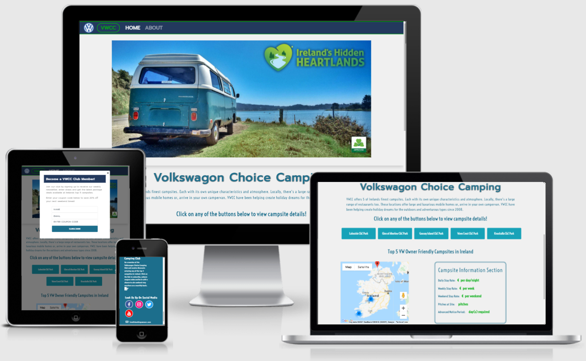

View the live project here:[ VWCC ](https://ferdosull.github.io/Milestone_Project_02/index.html)  

## My Project Description and Design 

The VWCC website is a single page responsive website which utilises javasript event listeners and onclick functions to change displayed data and navigation links. 
Please see initial envisioned wireframes (before project start) and actual screenshots of the finished website in the sections that follow:
  

### Wire Frames 

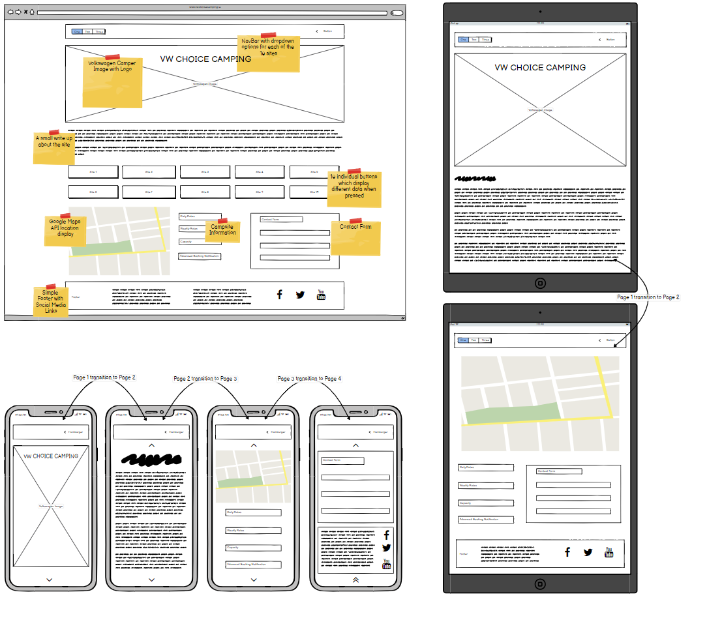

### Pop up Modal 

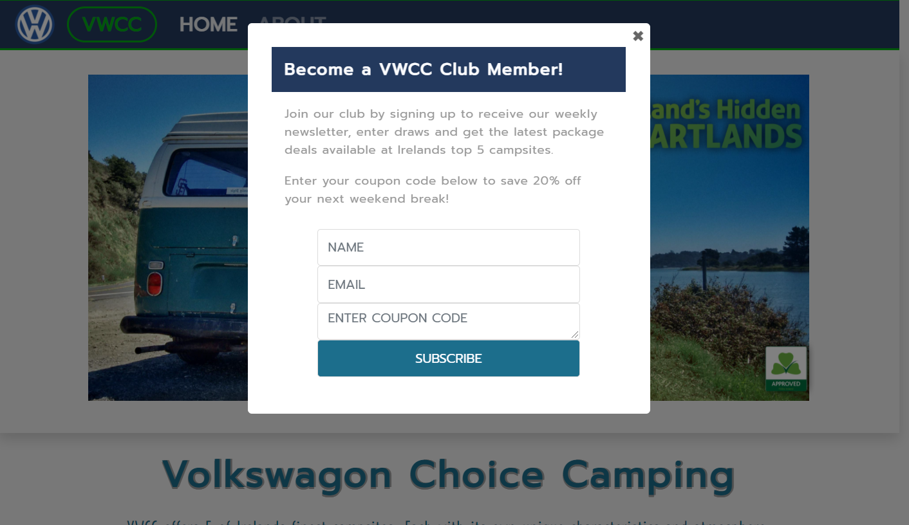

### Nav Bar 

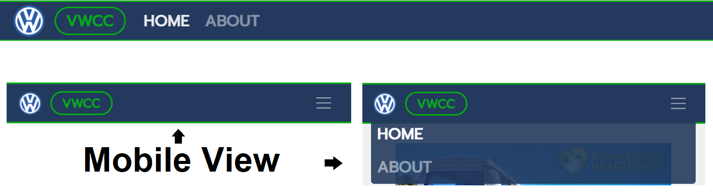

### Hero Image 

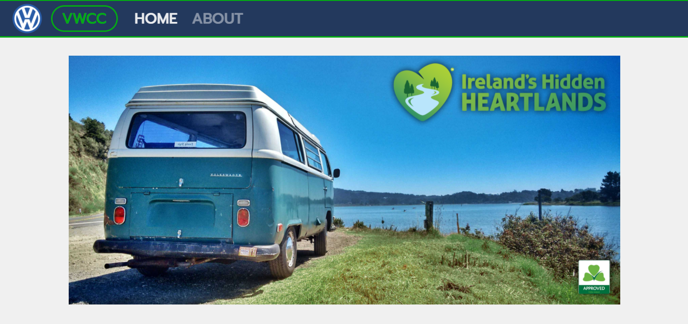

### Header & Description Text 

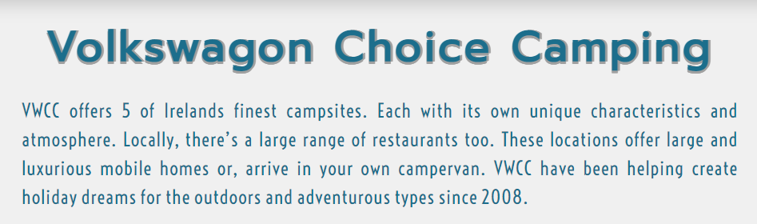

### Page Links 

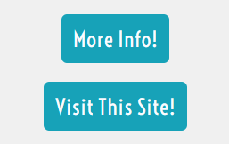

### Top 5 Buttons 

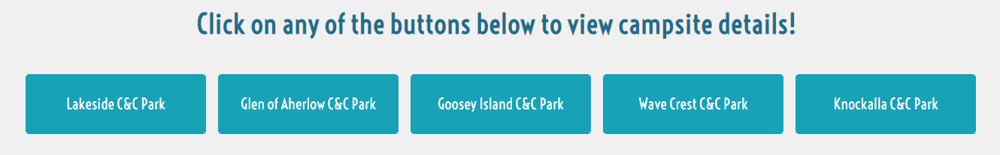

### Google Maps 

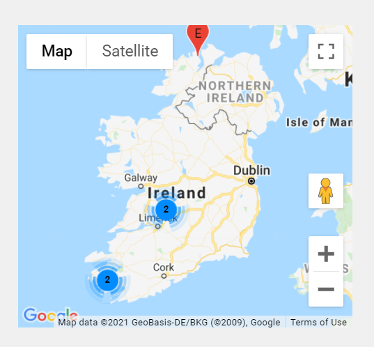

### Campsite Information 

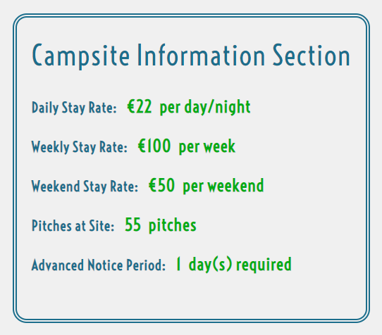

### Footer 

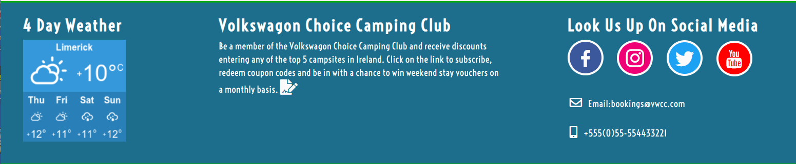

## Creation of Template and Deployment of this Project (GitHub & GitPod) 

**Creating a new project** 

Once logged into GitHub I created my project by clicking on the “New” repository button in the top left of the screen. 

After clicking on the “New” button I was navigated to the “Create New Repository Page” [https://github.com/new ](https://github.com/new). 
I selected Code Institutes full template and checked the box to include all branches. 
I gave the Repository a name “Milestone\_Project\_02” and a description “VW Enthusiasts Top 5 Best Campsites in Ireland”. 
I left the repository set to “Public” and pressed the “Create Repository” button. Please see below: 

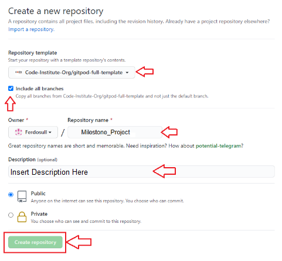

After the repository was created I navigated to it [repository][https://github.com/Ferdosull/Milestone_Project_02.](https://github.com/Ferdosull/Milestone_Project_02) 
I then clicked the “GitPod” green button which created my new workspace for the project based on the template chosen. 
All additions and changes made to complete this project were carried out in this workspace with some initial works completed offline in Notepad ++, then uploaded and committed.  

**Commands Utilised Throughout The Project After Changes:** 

“git add /specified file folder/specified file/file extension“: This command is used to add edited files to the staging area before carrying out a commit. 

“git commit -m \*commit message summarising the updates\*”: This command is used to commit the changes made to any files which had been previously added with “git add”. 

“git push”: This command is used to push git commit changes to the GitHub hosting pages and so that they can be viewed on a browser.  

**How to Deploy My Milestone\_Project\_02 on GitHub Pages** 

1. Navigate to the GitHub [Repository:[\]https://github.com/Ferdosull/Milestone_Project_02 ](https://github.com/Ferdosull/Milestone_Project_03)**

2. Click on the 'Settings' Tab highlighted in the following screenshot.** 

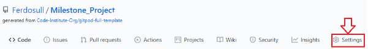

3. Scroll Down to the GitHub Pages section and select “Master” from the first drop down menu and click the “Save” button. Please see below:** 

4. Once the project has been published, navigate back down to the GitHub Pages section and click on the link provided to navigate to live deployed site. Please see below:** 

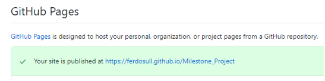

**How to Download, View and Edit This Project Locally using Notepad++** 

1. Navigate to the GitHub [Repository:][ https://github.com/Ferdosull/Milestone_Project_02 ](https://github.com/Ferdosull/Milestone_Project_02)

2. Click on the “Code” drop down menu beside the “Gitpod” button. Please see below: 

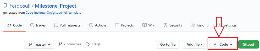

3. From the drop-down menu, select “Download ZIP”. After the file folder has downloaded, navigate to your PCs “Downloads” folder, then cut and paste the Zip file into a 
location where you are comfortable to unpack it. I have created a folder on my desktop called “Code-Institute-Projects”. 

4. Once you have successfully unpacked the Zip file, navigate to the index.html file and double click it to browse the project locally. 
It will load in your default browser. As can be seen from the screenshot below, my default browser is Google Chrome: 

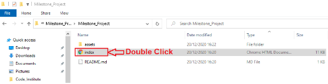

5. If you wish to edit the index.html file or the style.css, sendEmail.js and script.js files located in the “assets” folder, you need to right click on the file you wish to edit and 
open with Notepad++. 

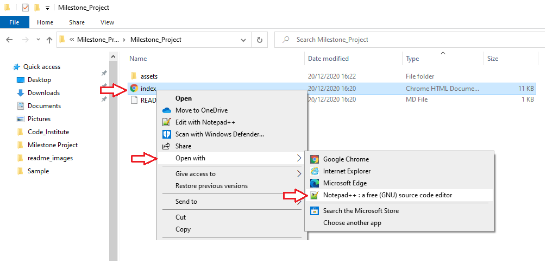

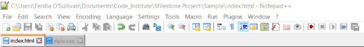

6. Once opened in the Notepad++ editor you can make changes to the html css and js files, save the changes and re-open or refresh your browser to see the impact. 

## Acknowledgements 

I'd like to say a special thank you to my mentor Maranatha Ilesanmi for his excellent advice and recommendations throughout the project. 
