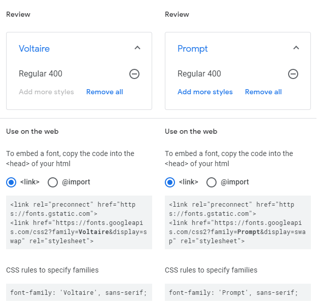

# Milestone Project 02 

### Volkswagon Choice Camping Top 5 Destinations  

## Table of contents
1. [Introduction](#intro)
2. [Responsive Design](#responsive_design)
3. [My Project Description and Design](#project_description)
    1. [Wire Frames](#wire_frame)
    2. [Pop up Modal](#pop_modal)
    3. [Nav Bar](#nav_bar)
    4. [Hero Image](#hero_image)
    5. [Header & Description Text](#header_description)
    6. [Page Links](#page_links)
    7. [Top 5 Buttons](#t5_buttons)
    8. [Google Maps](#g_map)
    9. [Campsite Information](#campsite)
    10. [Footer](#footer)
4. [Utilising the 5 Planes of UX Design](#ux_design)
    1. [The Strategy Plane](#strategy_plane)
    2. [The Scope Plane](#scope_plane)
    3. [The Structure Plane](#structure_plane)
    4. [The Skeleton Plane](#skeleton_plane)
    5. [The Surface Plane](#surface_plane)
5. [Typography](#typography)
6. [User Stories](#user_stories)
    1. [External User's Goal](#external_user_goal)
    2. [Site Owner's Goal](#site_owner_goal)
    3. [First Time User Goals](#first_time_user_goals)
    4. [Returning User Goals](#returning_user_goals)
    5. [Frequent User Goals](#frequent_user_goals)
7. [Bugs and Fixes](#bug_fixes)
8. [References and Credits Section](#references_and_credits)
    1. [Code](#code)
    2. [Media](#media)
9. [User Testing](#testing)
    1. [Website Responsiveness](#testing_procedure)
    2. [Call to Action Functionality Testing](#testing_user_stories)
    3. [HTML CSS and JavaScript Validation](#validation)
10. [Future "Nice to Have" Additions to The Website](#additions)
11. [Creation of Template and Deployment of Project](#project_deployment)
    1. [Creating a New Project](#new_project)
    2. [Commands Utilised Throughout The Project After Changes](#commands)
    3. [How to Deploy My Milestone\_Project\_02 on GitHub Pages](#how_to_deploy)
    4. [How to Download, View and Edit This Project Locally using Notepad++](#how_to_download)
12. [Acknowledgements](#acknowledgements)  

## Introduction 

My Milestone Project 2 was envisioned by me and created based on the knowledge gained so far from this course. 
I have taken the fundamentals that I have learned from the course and applied them to this website with style changes and JS functions to suit my application.
I hope that the outcome of my works has translated into a front-end web application with JavaScript functions, that is accessible, responsive and promotes good user experience
through the use of HTML, CSS, Javascript, Google Maps API and Email.js.
As well as the course materials, there have been some additional code examples which I have found online and utilised. 
These additions have been highlighted and referenced later on in this document (references and credits section).
As well as these additions I have received excellent correction & further instruction from my mentor Maranatha Ilesanmi which I am extremely grateful for.

## Responsive Design 

As can be seen in the screenshot below, media queries have been used to ensure that the website is completely responsive across Desktop and Mobile devices.

View the live project here:[ VWCC ](https://ferdosull.github.io/Milestone_Project_02/index.html)  

## My Project Description and Design 

The VWCC website is a single page responsive website which utilises JQuery & javasript methods and functions to change displayed data, images and navigation links. 
Please see initial envisioned wireframes (before project start) and actual screenshots of the finished website in the sections that follow:
  

### Wire Frames 

The wire-frames I found to be very useful this time around. I had envisioned doing a top 10 campsites, as can be seen in the wire-frames above, but the workload was too much to 
try and fit into the time frame before submission. The code (JavaScript "campsite" Object) has been left in such a way that five or ten more locations could be added at a later date, 
at the clients request.
  

### Pop up Modal 

The Pop-Up modal is the first item to load from the script.js file once the main page has been loaded. The Pop-up modal is my take on utilising the form element in conjunction with Emailjs.
It is fully functioning as can be seen from the incorporated screenshots below. I have changed the "Project Request" section to be an "Enter Coupon" section for redeeming percentage-off holiday stays.
I have only used the "required" status for the name and email element form entry just incase the visitor does not have a coupon code but still wishes to subscribe to the VWCC club.
  

### Nav Bar 

On this occassion I have decided not to have the nav-bar fixed to the top. Once the page is scrolled it stays at its absolute location. I felt that the minimal appearance I was going for would appear 
crowded in this circumstance if the nav-bar followed. The nav-bar can be separated up into desktop and mobile views as seen below. The "HOME" and VWCC logo both reload the page while the "About" selector 
scrolls the visitor to the info section, which is roughly halfway down the page.
  

### Hero Image 

The Hero Image that loads upon first display of the page is of an iconic VW campervan, which is keeping in line with the clubs theme. This image is then updated through five other images using button clicks 
to initialte JavaScript targeting of ids in the html and changing the image source. This is completed with delay transition timers in conjunction with the addion and removal of CSS classes to provide opacity effects.
  

### Header & Description Text 

The Header text, when first landed on the page, is the name of the club, "Volkswagon Choice Camping" and the description text below it is a small summary of what the club provides the site visitor.
Both the Header and the description text get updated when any of the Top five buttons are pressed. For example, if "Lakeside C&C Park" is clicked/selected the header text and description text will change to 
be in line with the button chosen. Like the hero image, this is also completed with delay transition timers in conjunction with the addion and removal of CSS classes to provide opacity effects
  

### Page Links 

Underneath the description text are two selectors. "More Info!" and "Visit This Site!". The "More Info!" button is only visible on tablet and mobile devices. Its function is to scroll the visitor to the 
campsite information section associated with the location that is currently being displayed. The "Visit This Site!" button has a href that is updated by JavaScript based also on the location being displayed.
If pressed it will navigate the user to an external page associated with the campsite selected.
  

### Top 5 Buttons 

The Top 5 Buttons are used as "onclick" functions within the html, passing the 5 different key value variables for my object ("campsites") through the "initMod" function.
The initMod function extracts only the required values from my object by using a filter method to update the global variables to be used by the subsequent functions.
  

### Google Maps 

When landing on the page initially the Google Maps div displays the Top 5 locations on a zoomed out map of Ireland.
When any of the Top 5 buttons are clicked/selected, that particular location selected is displayed and zoomed closer, 
with its full name as the label instead of a zoomed out capitol letter character, as was displayed initially.
  

### Campsite Information 

The campsite Information Section displays the following information for each site: Daily Stay Rate, Weekly Stay Rate, Weekend Stay Rate, 
The Campsite Pitch Capacity and the Advance Notice period for booking a stay with them. Again, like before, this information updates for 
each location based on the button clicked/selected.
  

### Footer 

The footer contains 3 sections, 1. A weather widget which also updates upon utilising the Top 5 buttons, 2.  A small paragraph 
enticing visitors of the site to join the club. At the end of this paragraph is a font awesome icon (newsletter) which, if clicked/selected, will re-load the 
modal form again to allow the visitor the second time option to subscribe. 3. Social media icons which link to their respective pages, an email link which opens the 
visitors default email service and populates the “To” section with bookings@vwcc.com, and an external phone link shortcut for use when viewed on mobile phone devices.
  

To ensure that I utilised the correct icon colours for each of the social media outlets in the footer I navigated to their official brand media pages 
and used a HTML colour picker to select the correct colour. 
Please see the image below of the colours picked for each icon using the following HTML colour picker: https://imagecolorpicker.com/en/
  

  

**The Structure Plane** 

This website is a single page layout. It has a nav-bar at the top and a footer at the bottom. 
The nav-bar turns into a mobile friendly toggler once below a specific resolution as dictated by the bootstrap class. On the left of the nav-bar is the Volkswagon logo, the VWCC lettering, 
a “Home” selector and an “About” selector. Links in the nav-bar will change style on hover as is standard with the bootstrap navbar class. I have styled the hover colour to be green to fit 
in with the rest of the webpages colour scheme. Underneath the nav-bar is where the “Hero-Image” is located. Underneath the hero image is where the jumbotron header and info paragraph can be found. 
The hero image, jumbotron header and info paragraph are all updated through JavaScript once 1 of the 5 buttons are clicked/selected. Below the info paragraph is the “Visit This Site!” button. 
This is hidden until a campsite is selected. Once a campsite is selected this same button will navigate you to the external page associated with that campsite.
There is a “More Info” button below the “Visit This Site” button that is only displayed on mobile devices to allow for fast scroll to the campsite information section.
The 5 buttons that carry out this function can be found in the vertical middle of the page. Underneath the 5 buttons are the Google Maps display div and the individual campsite information section. 
Both the Google Maps display coordinates and campsite information sections are also updated upon one of the 5 campsite buttons being clicked/selected.
The footer contains 3 sections, 1. A weather widget which also updates upon utilising the above five buttons, 2.  A small paragraph again urging visitors of the site to join the club. 
At the end of this paragraph is a font awesome icon which, if clicked/selected, will re-load the modal form again to allow the visitor to subscribe. 3. Social media icons which link to their respective pages, 
an email link which opens the visitors default email service and populates the “To” section with bookings@vwcc.com, and an external phone link for when viewed on mobile devices.

## Typography 

The fonts used for the milestone project are: “Voltaire” and “Prompt”. 

Both fonts were located and used from the website:[ https://fonts.google.com/ ](https://fonts.google.com/)

I felt the contrast between Voltaire and Prompt has worked quite well. I have used Prompt for the nav bar and the jumbotron header and throughout the rest of 
the project I have used Voltaire to bring the almost cartoon-like feeling associated with the colour scheme. I have made subtle changes to the font sizes and 
spacings for responsiveness as can be seen in the style.css sheet. 
  

## User Testing 

**Website Responsiveness** 

For the functionality and responsiveness testing of this website I have utilised the following web browsers: Microsoft Edge, Mozilla Firefox and Google Chrome.

To carry out testing on mobile devices I have used Google Chrome as well as Safari on my IPad and IPhone.

During all stages of JavaScript method & function verification, console.log() was utilised to simulate the required results.  

Please see the testing procedure table I have created for the VWCC website below:
  

**Call to Action Functionality Testing Procedure** 

The table below was created to ensure no user testing steps were omitted when carrying out finished website checks. As part of my finised checks I have had a friend of mine 
who is a senior UX designer, navigate through the site using the table created to search for errors. Initial errors were found and solved. They can be found in the bugs section.
  

### At all stages during testing, text was evaluated for spelling, grammer and punctuation.  

**HTML CSS and JavaScript Validation** 

Testing Code Validators for all sections of the website were carried out at: 

HTML =[ https://validator.w3.org/ ](https://validator.w3.org/) CSS =[ https://jigsaw.w3.org/css-validator/ ](https://jigsaw.w3.org/css-validator/) and JavaScript = [ https://jshint.com/ ](https://jshint.com/)

Below are screenshots of the results of my HTML page, my CSS stylesheet, and both JavaScript files. All Sections Passed with no errors:

### index.html

### style.css

### scripts.js

### sendMail.js

  

## Future "Nice to Have" Additions to The Website 

If I could make further additions to the VWCC website down the line they would be to include the following:

 * A "Log In" and payments section for returning users. This would provide processing and storage of the visitors previous vacation information, similar to booking.com.
 Accumulated trips with the VWCC would enable them to build up a points whereby further discounts or coupons could be passed back to the visitor.

 * At some point down the line I would envision the Top 5 website becoming the Top 10 or the Top 20. The JavaScript code has been left in souch a way that this is possible
 by the most efficient means. This would require additional info, additional website links, additional images and updating the "campsites" object.

 * I think a customer review section for each location could be a good idea and a place where visitors can provide a star rating based on their stay.

 * For the specific locations chosen by the 5 buttons I would like to show restaurants, attractions and other areas of interest on the Google Maps display also.
 It would involve some more research into each area and further additions to campsite object in the file script.js, but all possible in the future.
  

## Creation of Template and Deployment of this Project (GitHub & GitPod) 

**Creating a new project** 

Once logged into GitHub I created my project by clicking on the “New” repository button in the top left of the screen. 

After clicking on the “New” button I was navigated to the “Create New Repository Page” [https://github.com/new ](https://github.com/new). 
I selected Code Institutes full template and checked the box to include all branches. 
I gave the Repository a name “Milestone\_Project\_02” and a description “VW Enthusiasts Top 5 Best Campsites in Ireland”. 
I left the repository set to “Public” and pressed the “Create Repository” button. Please see below: 

After the repository was created I navigated to it [repository][https://github.com/Ferdosull/Milestone_Project_02.](https://github.com/Ferdosull/Milestone_Project_02) 
I then clicked the “GitPod” green button which created my new workspace for the project based on the template chosen. 
All additions and changes made to complete this project were carried out in this workspace with some initial works completed offline in Notepad ++, then uploaded and committed.  

**Commands Utilised Throughout The Project After Changes:** 

“git add /specified file folder/specified file/file extension“: This command is used to add edited files to the staging area before carrying out a commit. 

“git commit -m \*commit message summarising the updates\*”: This command is used to commit the changes made to any files which had been previously added with “git add”. 

“git push”: This command is used to push git commit changes to the GitHub hosting pages and so that they can be viewed on a browser.  

**How to Deploy My Milestone\_Project\_02 on GitHub Pages** 

1. Navigate to the GitHub [Repository:[\]https://github.com/Ferdosull/Milestone_Project_02 ](https://github.com/Ferdosull/Milestone_Project_03)**

2. Click on the 'Settings' Tab highlighted in the following screenshot.** 

3. Scroll Down to the GitHub Pages section and select “Master” from the first drop down menu and click the “Save” button. Please see below:** 

4. Once the project has been published, navigate back down to the GitHub Pages section and click on the link provided to navigate to live deployed site. Please see below:** 

**How to Download, View and Edit This Project Locally using Notepad++** 

1. Navigate to the GitHub [Repository:][ https://github.com/Ferdosull/Milestone_Project_02 ](https://github.com/Ferdosull/Milestone_Project_02)

2. Click on the “Code” drop down menu beside the “Gitpod” button. Please see below: 

3. From the drop-down menu, select “Download ZIP”. After the file folder has downloaded, navigate to your PCs “Downloads” folder, then cut and paste the Zip file into a 
location where you are comfortable to unpack it. I have created a folder on my desktop called “Code-Institute-Projects”. 

4. Once you have successfully unpacked the Zip file, navigate to the index.html file and double click it to browse the project locally. 
It will load in your default browser. As can be seen from the screenshot below, my default browser is Google Chrome: 

5. If you wish to edit the index.html file or the style.css, sendEmail.js and script.js files located in the “assets” folder, you need to right click on the file you wish to edit and 
open with Notepad++. 

6. Once opened in the Notepad++ editor you can make changes to the html css and js files, save the changes and re-open or refresh your browser to see the impact. 

## Acknowledgements 

I'd like to say a special thank you to my mentor Maranatha Ilesanmi for his excellent advice and recommendations throughout the project.
I have learned alot from his teachings and I hope to pick up some more from him throughout the next two projects. 
