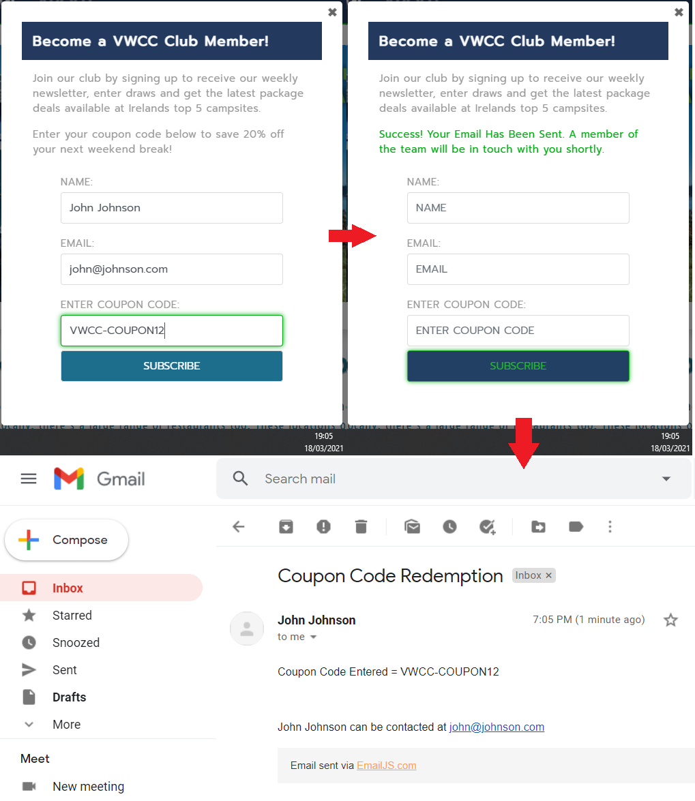

# Milestone Project 02 

### Volkswagon Choice Camping Top 5 Destinations  

## Table of contents
1. [Introduction](#intro)
2. [Responsive Design](#responsive_design)
3. [My Project Description and Design](#project_description)
    1. [Wire Frames](#wire_frame)
    2. [Pop up Modal](#pop_modal)
    3. [Nav Bar](#nav_bar)
    4. [Hero Image](#hero_image)
    5. [Header & Description Text](#header_description)
    6. [Page Links](#page_links)
    7. [Top 5 Buttons](#t5_buttons)
    8. [Google Maps](#g_map)
    9. [Campsite Information](#campsite)
    10. [Footer](#footer)
4. [Utilising the 5 Planes of UX Design](#ux_design)
    1. [The Strategy Plane](#strategy_plane)
    2. [The Scope Plane](#scope_plane)
    3. [The Structure Plane](#structure_plane)
    4. [The Skeleton Plane](#skeleton_plane)
    5. [The Surface Plane](#surface_plane)
5. [Typography](#typography)
6. [User Stories](#user_stories)
    1. [External User's Goal](#external_user_goal)
    2. [Site Owner's Goal](#site_owner_goal)
    3. [First Time User Goals](#first_time_user_goals)
    4. [Returning User Goals](#returning_user_goals)
    5. [Frequent User Goals](#frequent_user_goals)
7. [Bugs and Fixes](#bug_fixes)
8. [References and Credits Section](#references_and_credits)
    1. [Code](#code)
    2. [Media](#media)
9. [Testing](#testing)
    1. [Website Responsiveness and Call to Action Functionality Testing Procedure](#testing_procedure)
    2. [Testing User Stories](#testing_user_stories)
    3. [HTML and CSS Validation](#validation)
10. [Future "Nice to Have" Additions to The Website](#additions)
11. [Creation of Template and Deployment of Project](#project_deployment)
    1. [Creating a New Project](#new_project)
    2. [Commands Utilised Throughout The Project After Changes](#commands)
    3. [How to Deploy My Milestone\_Project\_02 on GitHub Pages](#how_to_deploy)
    4. [How to Download, View and Edit This Project Locally using Notepad++](#how_to_download)
12. [Acknowledgements](#acknowledgements)  

## Introduction 

My Milestone Project 2 was envisioned by me and created based on the knowledge gained so far from this course. 
I have taken the fundamentals that I have learned from the course and applied them to this website with style changes and JS functions to suit my application.
I hope that the outcome of my works has translated into a front-end web application that is accessible, responsive and promotes good user experience
through the use of HTML, CSS, Javascript, Google Maps API and Email.js.
As well as the course materials, there have been some additional examples which I have found online and utilised. 
These additions have been highlighted and referenced later on in this document (references and credits section).
As well as these additions I have received excellent correction & further instruction from my mentor Maranatha Ilesanmi which I am extremely grateful for.

## Responsive Design 

As seen in the screenshot below, media queries have been used to ensure that the website is completely responsive across Desktop and Mobile devices.

View the live project here:[ VWCC ](https://ferdosull.github.io/Milestone_Project_02/index.html)  

## My Project Description and Design 

The VWCC website is a single page responsive website which utilises javasript event listeners and onclick functions to change displayed data and navigation links. 
Please see initial envisioned wireframes (before project start) and actual screenshots of the finished website in the sections that follow:
  

### Wire Frames 

### Pop up Modal 

### Nav Bar 

### Hero Image 

### Header & Description Text 

### Page Links 

### Top 5 Buttons 

### Google Maps 

### Campsite Information 

### Footer 

